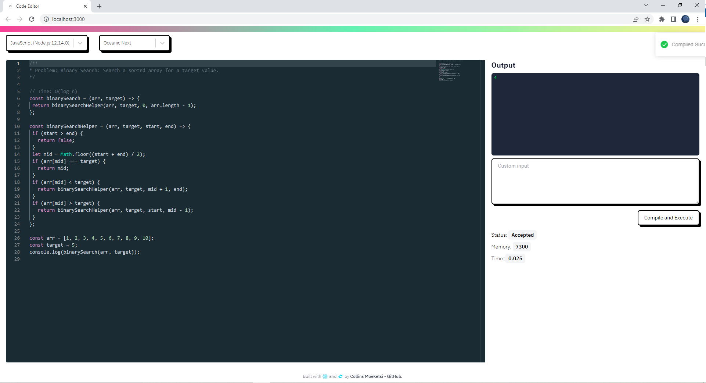

# Compile and Execute code in 46 languages
## Site: 
<a href="https://stellular-tanuki-561b2d.netlify.app" target="__blank">https://stellular-tanuki-561b2d.netlify.app<a>
⚡️ Write code, compiles and runs your code on the web.

## Features: 
- Compile and execute code in 40+ programming languages.
- Switch themes from a list of available themes.

## Enviroment

- clone repo
- A sample `.env.sample` file is given, Register on <a href="https://rapidapi.com/judge0-official/api/judge0-ce/pricing" target="__blank">RapidAPI</a> ang get your API keys.
- Create a `.env` file.
- Add the API Keys in the `.env` file
- `npm start` to run the project.
